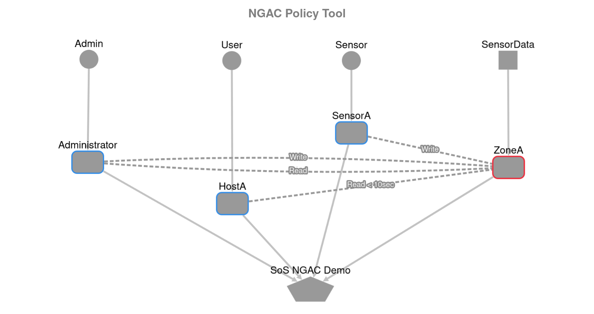

# Arrowhead Framework System of Systems NGAC Project (Java Spring-Boot)

## Description
A System of Systems implementation of NGAC using Eclipse Arrowhead. In the demo, a consumer sends requests to access (read/write) a data object in a time series database, and is given permission only if the corresponding policy is set in the NGAC server.


### Policy used in the demo




### Requirements

The project has the following dependencies:
* **JRE/JDK 11** [Download from here](https://www.oracle.com/technetwork/java/javase/downloads/jdk11-downloads-5066655.html)
* **Maven 3.5+** [Download from here](http://maven.apache.org/download.cgi) | [Install guide](https://www.baeldung.com/install-maven-on-windows-linux-mac)
* **The Open Group's Policy Machine**  [Download from here](https://github.com/esen96/tog-ngac-crosscpp-LTU) | The policy server provider of this project interfaces with the policy machine to enforce access rights and utilizes a local instance of the ngac server. [Setup guide](#ngacserver)
* **InfluxDB** [Download from here](https://portal.influxdata.com/downloads/)  
* **Authorization settings for the demo systems in your local arrowhead database**

  ***By Arrowhead Management Tool***
  - coming soon
  
  ***By Swagger API documentation***
  
  - [Click here](#authorizationsettings) for a detailed description on Swagger API management for this project. 
  
  ***By MySQL queries***
  
  *Intra-Cloud:*
  - Insert a new entry with the consumer details into the `system_` table.
  - Insert a new entry with the IDs of consumer entry, provider entry and the service definition entry into the `authorization_intra_cloud` table.
  - Insert a new entry with the IDs of authorization intra cloud entry and service interface entry into the `authorization_intra_cloud_interface_connection` table.
  
  *Inter-Cloud:*
  - Insert a new entry with the cloud details into the `cloud` table. The `authentication_info` have to be filled out with the gatekeper's public key of the cloud.
  - Insert a new entry with the IDs of the cloud entry, provider entry and the service definition entry into the `authorization_inter_cloud` table.
  - Insert a new entry with the IDs of authorization inter cloud entry and service interface entry into the `authorization_inter_cloud_interface_connection` table.


# Setup guide

## Launching the Arrowhead Core Systems

For the Arrowhead documentation, go to the [core-java-spring](https://github.com/eclipse-arrowhead/core-java-spring) repository.

A recording of the setup process on a Windows system: https://www.youtube.com/watch?v=52Up5iDJKx4&ab_channel=AITIAInternationalZrt.

### Installation issues

I had some issues with installing the core systems and I decided to list them here in case it might be of use to anyone.

1) The docker setup doesn't seem to work out of the box due to a docker image issue. Me and several others have encountered the same issue but it is not yet officially fixed. See [this issue](https://github.com/eclipse-arrowhead/core-java-spring/issues/361)
2) I had to install MySQL 5.7+ instead of the newer MySQL 8.0+ versions when doing a native install since the SQL scripts in the core-java-spring repository uses deprecated commands
3) I had to allow remote connection in MySQL config to successfully run the Arrowhead SQL scripts


<a name="ngacserver" />

## Setting up the NGAC server

Download [SWI-Prolog](https://www.swi-prolog.org/Download.html) and clone the [NGAC Policy Machine](https://github.com/esen96/tog-ngac-crosscpp-LTU).

Follow the setup instructions in chapter 9 of the pdf documentation. For this project, we run the server in JSON mode, this is done by navigating to the root folder of the NGAC repository and running the ``./ngac-server -j`` command after the systems have been installed. 

Note that there might be security related authorization issues when running the server on a Windows system, which is why the NGAC server has been used mainly on Linux systems.

To set the demo policy for this project and run a few tests, navigate to the ``sos-ngac-demo`` folder and execute the ``demo.sh`` script.

## InfluxDB configuration
Enable HTTP communication in your influxDB config file and bind the port to its original address, leave the standard time formatting as is.

The DB configuration can be deduced by looking at the [Resource Access Point Constants](https://github.com/esen96/sos-ngac/blob/master/sos-ngac/sos-ngac-resource-system/src/main/java/ai/aitia/sos_ngac/resource_system/rap/RAPConstants.java).

In essence: 
* Create a root user with full privileges and the same configuration as listed in the RAPConstants file. Alternatively, you can create a superuser with your own information, in which case you'll need to change some of the constants. 

* Create a database either with the same name as the one listed in the constants, or create one with another name and change the constant.

* The measurement used in the demo will be automatically created and populated by running the sensor in the Consumer application. 

## Running the project

1) Clone this repository to run the project natively. Alternatively, you can download the application executables from the latest release of this repository.
2) Start the NGAC server in JSON response mode by running the command ``./ngac-server -j`` in the [TOG PM project](https://github.com/esen96/tog-ngac-crosscpp-LTU)  root folder.
3) Load and set the correct policy file by navigating to the ``sos-ngac-demo`` folder inside the [TOG PM project](https://github.com/esen96/tog-ngac-crosscpp-LTU)  root folder. Run the ``demo.sh`` file and confirm that the server returns the correct response for each test case.
4) If you're using the application executables in the provided release, then the following step is not necessary. However, if you plan on running this project natively, then navigate to the root folder of this reposity and install the necessary dependencies:

```
mvn install
```
A successful installation will result in the following response:


<a name="authorizationsettings" />

## Authorization settings

It might be helpful to look at [this video](https://www.youtube.com/watch?v=9BHemnv3mQA&ab_channel=AITIAInternationalZrt.) for a demonstration of how a sample system is run. The steps for this project will be very similar to the ones in the video. Note that the authorization setup is only required when starting the system for the first time. 

1) Start the Arrowhead Core Systems on your machine. For this project, only the local core systems are necessary (Service Registry, Authorization, Orchestrator). Hence, you can run the start_coresystems_local.sh script for less bloat when using the Swagger API:s and reduced cpu usage.
2) Make sure you have access to the Swagger API:s of the Service Registry at ``https://localhost:8443``, and Authorization at ``https://localhost:8445``. If you have not done this before, you may have to import the sysop.p12 certificate from the core-java-spring repository to your browser. See the video or [the documentation](https://github.com/eclipse-arrowhead/core-java-spring) for instructions.
3) Run the Policy Server- and Resource System provider applications. These providers automatically register their services in the Service Registry core system. 
4) Go to the Swagger API of the Service Registry, open the ``Management`` tab and call ``GET serviceregistry/mgmt`` -> ``Try it out`` -> ``Execute``. 
5) Copy the entire JSON body of the ``query-interface`` service by the ``policyserver`` provider and the ``request-resource`` service of the ``resourcesystem`` provider. Save this information somewhere like a temporary .txt file as you will need it for setting the authorization rules.
6) Register the consumer by heading to the Swagger API of the Service Registry. Under the tab ``Management``, use ``POST serviceregistry/mgmt/systems`` -> ``Try it out`` and fill in the body of the consumer:

```
{
  "address": "localhost",
  "port": 8080,
  "systemName": "resourceconsumer"
}
```
Click ``Execute`` and you should get a JSON response with the full body of the consumer. Also save this data along with the data from earlier.

7) Go to the Authorization Swagger API at https://localhost:8445 and go to ``Management`` -> ``POST authorization/mgmt/intracloud`` and enter two sets of authorization rules.
 * Consumer -> Resource System: Fill the ``consumerID`` field with the ID from the resourceconsumer body JSON response saved from earlier. Enter the ``interfaceID``, ``providerID``, and ``serviceDefinitionID`` of the ``request-resource`` service system definition of the ``resourcesystem`` provider that we saved from earlier
 * Resource System -> Policy Server: Fill the ``consumerID`` field with the ID from the ``resourcesystem`` provider ID. Enter the ``interfaceID``, ``providerID``, and ``serviceDefinitionID`` of the ``query-interface`` service system definition of the ``policyserver`` provider that we saved from earlier
8) Restart the resource system application
9) You should now be able to run the consumer. Start by running the sensor, then instantiate a new consumer and send your queries!


